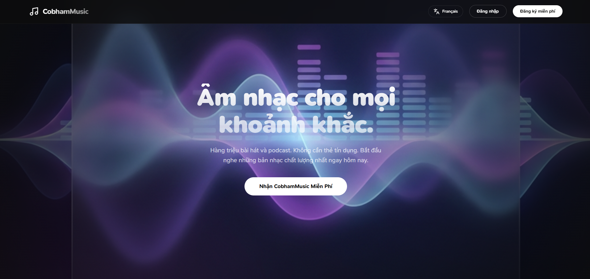
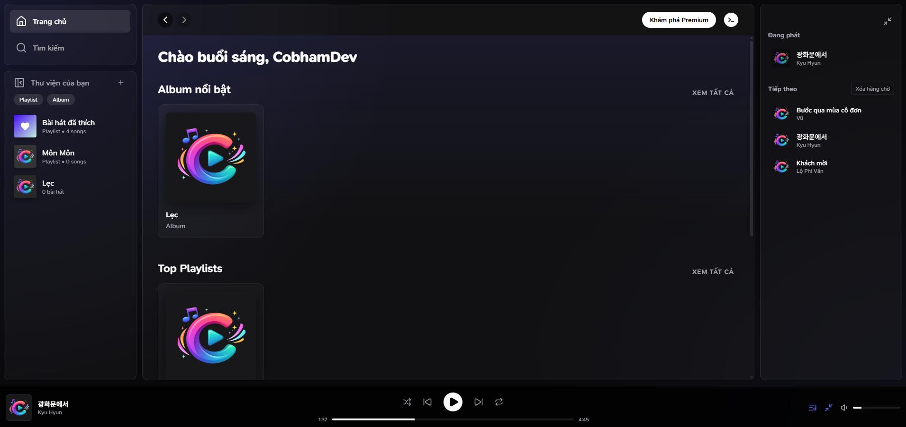
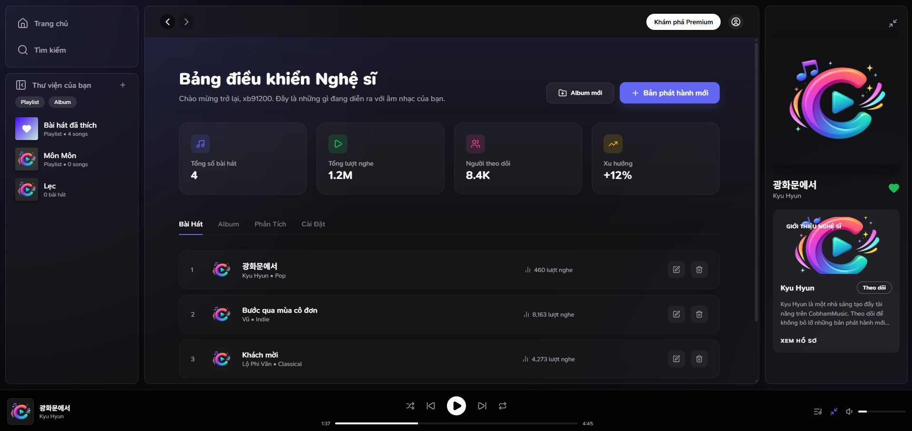
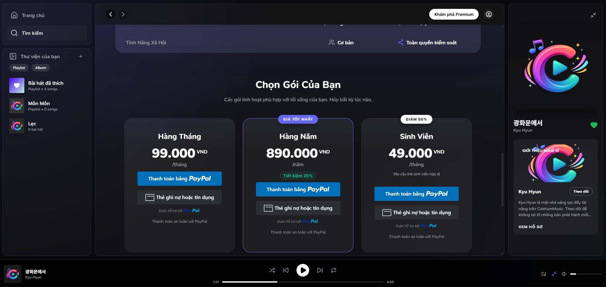
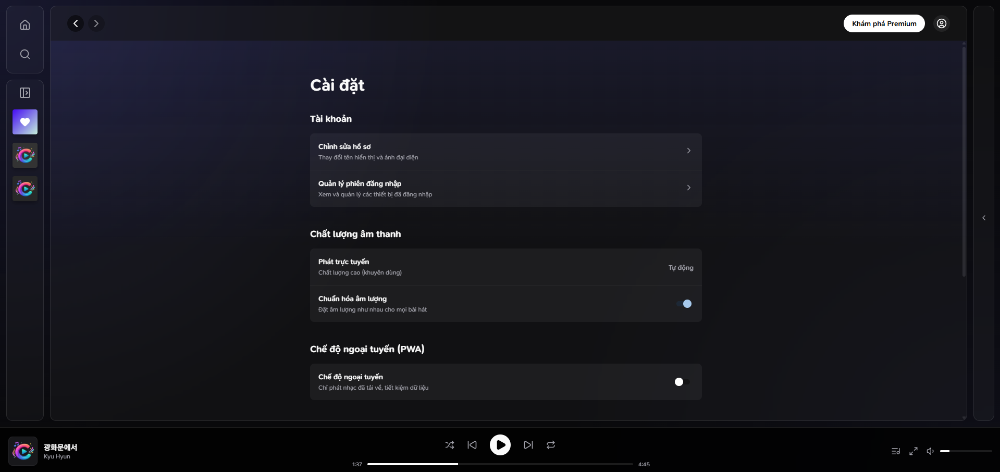

# CobhamMusic - Nền tảng Nghe nhạc Trực tuyến Cao cấp



## 🌟 Tổng quan
**CobhamMusic** là một ứng dụng nghe nhạc trực tuyến hiện đại, lấy cảm hứng từ Spotify với trải nghiệm người dùng cao cấp (Premium UI/UX). Hệ thống hỗ trợ phát nhạc, quản lý playlist, album cá nhân, và tích hợp thanh toán Premium qua PayPal.

---

## ✨ Tính năng Nổi bật

### 🎵 Trải nghiệm Người dùng
*   **Giao diện Premium**: Thiết kế tối hiện đại với glassmorphism, gradient động và micro-animations.
*   **Trình phát Nhạc Thông minh**: Tự động lưu tiến trình, hỗ trợ queue, shuffle, repeat modes.
*   **Đa ngôn ngữ (i18n)**: Hỗ trợ 8 ngôn ngữ: Tiếng Việt, English, 日本語, 한국어, 中文, Français, Deutsch, Español.
*   **PWA Ready**: Cài đặt như app native, hỗ trợ offline mode và push notifications.
*   **Quản lý Thư viện**: Tạo playlist, album cá nhân, và bài hát yêu thích.

### 🎤 Dành cho Nghệ sĩ
*   **Artist Dashboard**: Bảng điều khiển dành riêng cho nghệ sĩ với thống kê streams.
*   **Upload & Quản lý**: Tải lên bài hát, tạo album và quản lý nội dung dễ dàng.
*   **Hồ sơ Công khai**: Trang profile nghệ sĩ với danh sách bài hát và album.

### 💎 Premium & Thanh toán
*   **Gói Premium đa dạng**: Monthly, Yearly, Student với các mức giá linh hoạt.
*   **Tích hợp PayPal**: Thanh toán an toàn, xác thực realtime.
*   **Quản lý Subscription**: Xem lịch sử thanh toán, gia hạn hoặc hủy gói.

### 🛡️ Kỹ thuật & Bảo mật
*   **Xác thực Supabase**: OAuth (Google, GitHub), Magic Link và Email/Password.
*   **Lưu trữ an toàn**: Audio và artwork được lưu trữ trên Supabase Storage với signed URLs.
*   **API RESTful**: Backend Express.js với JWT authentication.

---

## 🛠️ Công nghệ Sử dụng

| Thành phần | Công nghệ |
| :--- | :--- |
| **Frontend** | React 18, Vite, SCSS, Zustand, React Router v6 |
| **Backend** | Node.js, Express.js, Prisma ORM |
| **Cơ sở dữ liệu** | PostgreSQL (Supabase) |
| **Lưu trữ** | Supabase Storage (S3-compatible) |
| **Xác thực** | Supabase Auth |
| **Thanh toán** | PayPal SDK |
| **UI Components** | Material-UI, Lucide Icons |
| **Internationalization** | i18next |

---

## 📁 Cấu trúc Dự án

```
music-app/
├── frontend/               # Mã nguồn giao diện (React + Vite)
│   ├── src/
│   │   ├── assets/         # SCSS, fonts, images
│   │   ├── components/     # UI components tái sử dụng
│   │   ├── containers/     # Layout containers
│   │   ├── pages/          # Page components
│   │   ├── store/          # Zustand stores
│   │   ├── services/       # API & business logic
│   │   ├── hooks/          # Custom React hooks
│   │   ├── i18n/           # Đa ngôn ngữ
│   │   └── constants/      # App constants
│   └── vite.config.js
│
├── backend/                # Mã nguồn máy chủ (Express.js)
│   ├── src/
│   │   ├── routes/         # API routes
│   │   ├── controllers/    # Request handlers
│   │   ├── services/       # Business logic
│   │   ├── middlewares/    # Auth, validation
│   │   └── prisma/         # Database schema
│   └── package.json
│
├── nginx/                  # Cấu hình Nginx
├── docker-compose.yml      # Docker orchestration
└── README.md
```

---

## 📸 Ảnh chụp màn hình

### Trang chủ


### Trình phát nhạc


### Artist Dashboard


### Premium


### Cài đặt


---

## 📝 API Endpoints

| Method | Endpoint | Mô tả |
| :--- | :--- | :--- |
| `GET` | `/api/songs` | Lấy danh sách bài hát |
| `POST` | `/api/songs` | Upload bài hát mới |
| `GET` | `/api/playlists` | Lấy playlists của user |
| `POST` | `/api/favorites/:songId` | Toggle yêu thích |
| `POST` | `/api/payments/create-order` | Tạo đơn thanh toán |
| `POST` | `/api/payments/capture` | Xác nhận thanh toán |

---

## 📄 License

Distributed under the MIT License. See `LICENSE` for more information.

---

<p align="center">
  Phát triển với ❤️ bởi <b>Cobham</b>
</p>
